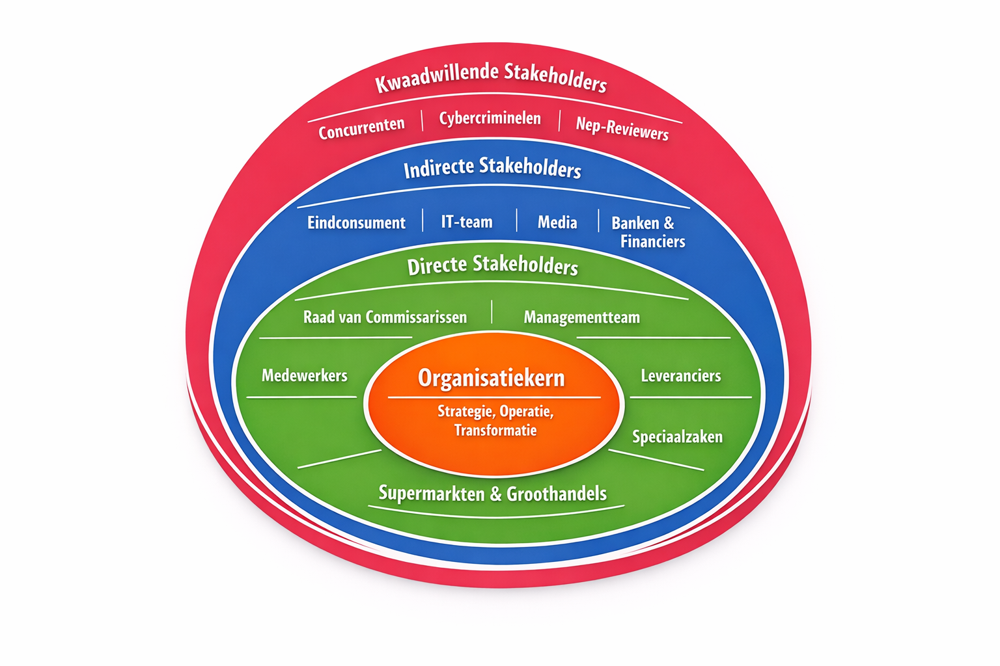
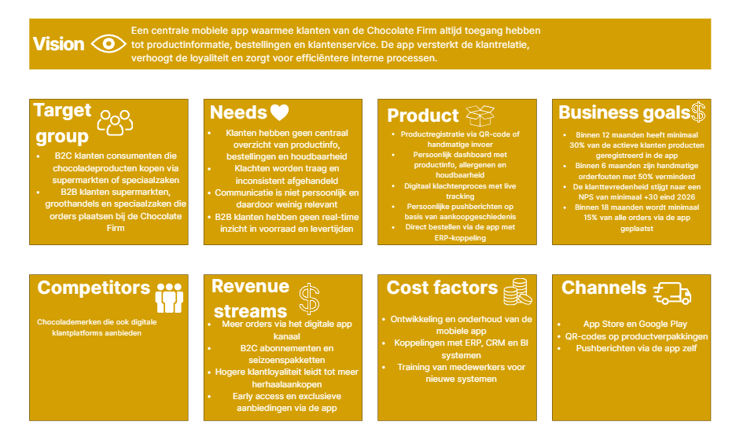
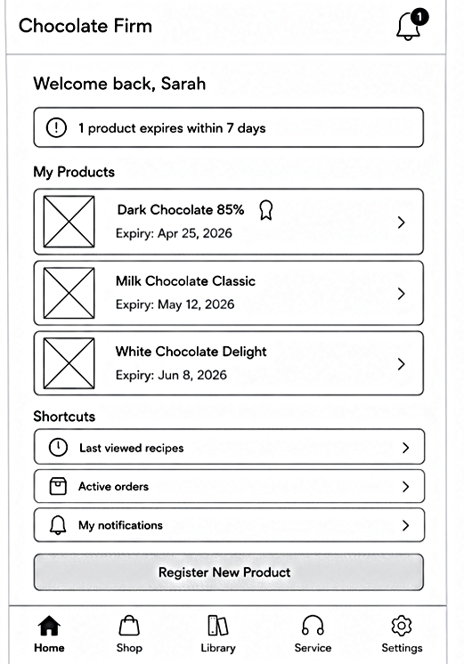
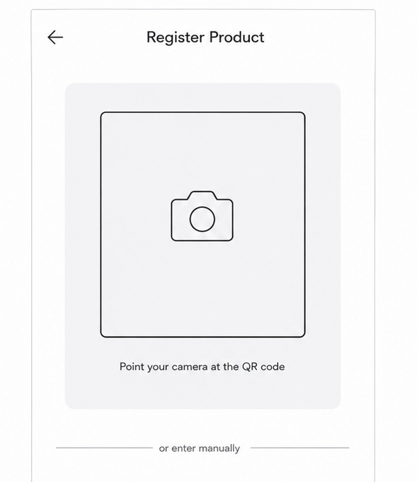
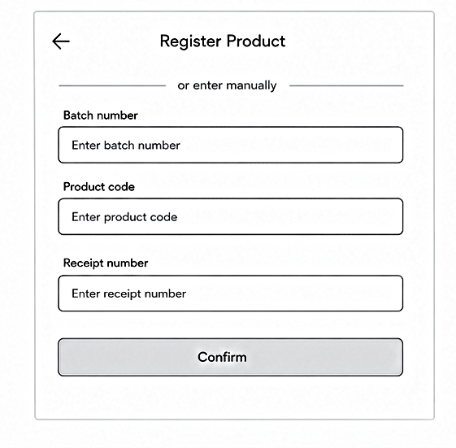
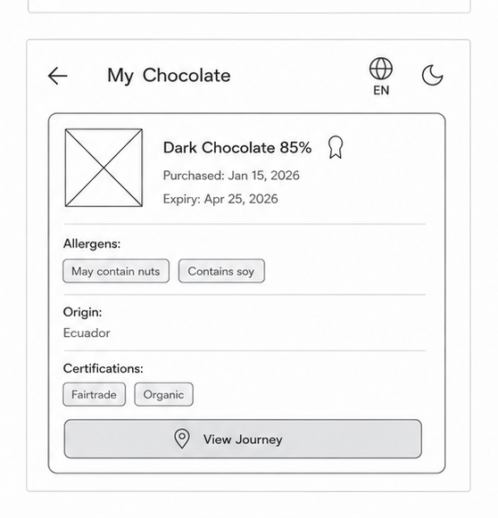
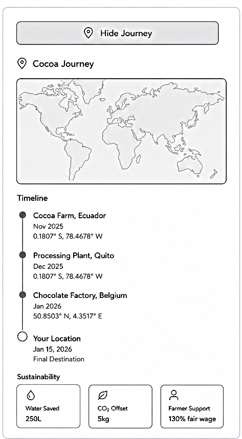
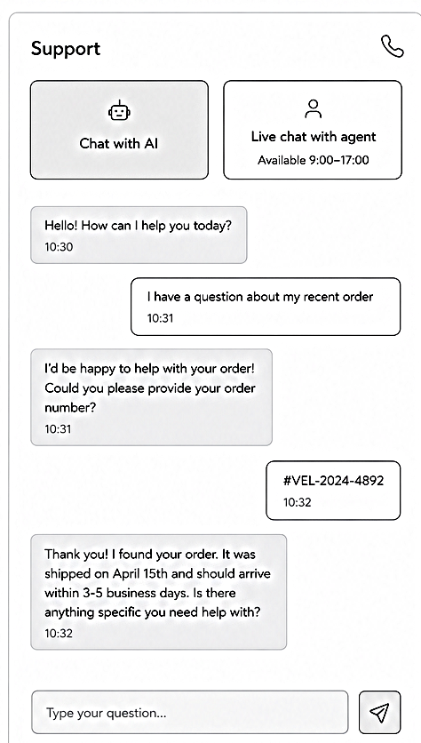
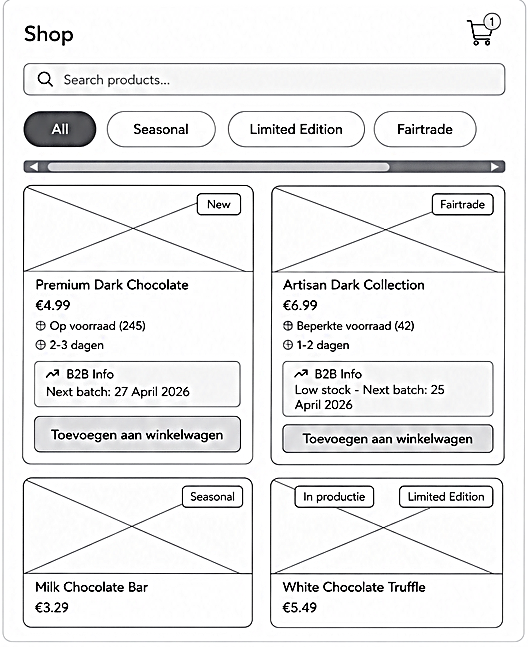

Markdown-inhoud
Chocolate Firm Requirement specificatie

**Inleiding**

De chocolate Firm is een chocoladeproducent die zich afspeelt in de game van Edumundo. Het bedrijf produceert tabletten, repen, uitdeelverpakkingen en seizoen producten en levert deze aan supermarkten, groothandels en speciaalzaken. Op dit moment werkt de organisatie nog grotendeels op basis van handmatige en verdeelde processen waarbij orders via verschillende kanalen binnenkomen, voorraden in papieren logboeken worden bijgehouden en facturen handmatig worden opgesteld. Dit leidt tot fouten, vertragingen en een gebrek aan overzicht dat groei van het bedrijf vermindert.

Om dit aan te pakken heeft de Raad van Commissarissen besloten een innovatieve mobiele applicatie te ontwikkelen die de klantervaring verbetert en werkt als startpunt van een bredere digitale transformatie. Dit document beschrijft de requirements specificatie van de Chocolate Firm.

**Missie**

Wij maken chocoladeproducten die mensen verbinden met smaak, kwaliteit en duurzaamheid.

Motto: Van boon tot reep, met passie voor elk product.

**Visie**

De Chocolate Firm wil de meest klantgerichte chocoladeproducent zijn, erkend om innovatie digitale dienstverlening, transparantie en duurzame productie.

**Strategie**

De chocolate Firm richt zich op drie strategische punten. Eerst wordt de interne organisatie op orde gebracht door processen te digitaliseren en automatiseren, zodat orders betrouwbaar worden verwerkt, voorraden real-time worden bijgehouden en de kwaliteitscontrole duidelijke vast wordt gelegd. Vervolgens wordt via een mobiele app een directe digitale relatie opgebouwd met klanten, wat zorgt voor meer loyale en waardevolle data voor productontwikkeling en marketing. Tot slot wordt de duurzame groei behaald door te focussen op Fairtrade, transparantie over de cacao afkomst en het uitbreiden naar nieuwe markten zoals seizoenpakketten en B2C-abonnementen

**Doelstellingen**

De Chocolate Firm stelt vier concrete doelstellingen. Binnen twaalf maanden na de lancering van de mobiele app heeft minimaal 30% van de actieve klanten hun producten geregistreerd in de app. Binnen zes maanden na implementatie van het nieuwe orderverwerkingssysteem zijn handmatige orderfouten met 50% verminderd ten opzichte van de huidige situatie. De klantentevredenheid, gemeten via de Net Promoter Score stijgt van de huidige baseline naar een score van minimaal +30 aan het einde van 2026. Tot slot wordt binnen achttien maanden na het uitbrengen van de app minimaal 15% van alle orders via het digitale app-kanaal geplaatst.

**Organogram**

|     |     |     |     |     |
| --- | --- | --- | --- | --- |
|     |     | Raad van Commissarissen |     |     |
|     |     | Managementteam (CEO) |     |     |
| Verkoop en marketing | Productie en logistiek | Inkoop en Voorraad | Klantenservice | Financiën |

**Stakeholderanalyse**

Bron: https://husite.nl/open-ict/sdgs-bij-open-ict/sdg-toolbox/stakeholderanalyse/

Directe stakeholders

|     |     |     |     |     |
| --- | --- | --- | --- | --- |
| Stakeholder | Rol | Impact | Voordelen | Nadelen |
| Raad van Commissarissen | Opdrachtgever | Hoog | Geeft en budget, zorgt voor strategisch samenwerking | Kan te hoge verwachtingen stellen of tempo forceren |
| Managementteam | Dagelijkse aansturing en beslissingen | Hoog | Verbindt strategie aan uitvoering | Te veel druk bij tegelijk veranderen en uitvoeren |
| Medewerkers | Uitvoering van processen, gebruikers van nieuwe systemen | Hoog | Kennen de knelpunten het best, kunnen verbeteringen aangeven | Moeite bij verandering en kunnen moeite hebben bij nieuwe tools |
| Supermarkten en groothandels | Grootste klanten, bulkorders | Hoog | Stabiele omzet | Hoge onderhandelingsmacht, prijsdruk op leveranciers |
| Speciaalzaken | Hogere marge | Midden | Hogere winstmarge, reputatie versterken via luxe kanalen | Kleine volumes, hogere servicekosten per klant |
| Leveranciers | Leveringen van grondstoffen, zorgen voor kwaliteit producten | Hoog | Fairtrade-samenwerking verbeterd reputatie en duurzaamheid | Leveringsrisico bij tekort of prijsstijging |

Indirecte stakeholders

|     |     |     |     |     |
| --- | --- | --- | --- | --- |
| Stakeholder | Rol | Impact | Voordelen | Nadelen |
| Eindconsument | App-gebruikers, kopers via supermarkt | Midden | Loyaliteit, directe feedback | Hoge verwachtingen van digitale ervaring |
| Ontwikkelaars/IT-team | Bouw en onderhoud app en ERP-koppeling | Hoog | Zorgen voor werkende app, brengen technische expertise | Kennis meenemen bij wisselen van baan/bedrijf |
| Media | Berichten over merk, duurzaamheid, incidenten | Midden | Positieve media versterkt merkbekendheid | Negatieve berichten bij recall of een data lek verslechterd merk reputatie |
| Banken en financiers | Financieren de investeringen | Midden | Geld beschikbaar voor digitale transformatie | Rente en terugbetaling verplichtingen |

Kwaadwillende stakeholders

|     |     |     |     |     |
| --- | --- | --- | --- | --- |
| Stakeholder | Rol | Impact | Voordelen | Nadelen |
| Concurrenten | Tegenstander bij prijs, assortimenten en digitale innovatie | Hoog | Stimuleren tot innovatie en scherp blijven | Kunnen klanten afpakken bij trage app of prijsvoordeel |
| Cybercriminelen | Aanvallen op app, klantdata of betalingssystemen | Hoog | Geen | Data lek, reputatieschade, AVG-boetes en downtime |
| Nep-reviewers | Verspreiden van vals negatieve reviews via app of social media | Laag | Geen | Verlies van klantenvertrouwen, reputatieschade |

UI-model

**Actoren**

Interne actoren

|     |     |     |     |
| --- | --- | --- | --- |
| Actor | Afdeling | Rol | Knelpunten |
| Managementteam | Directie | Dagelijkse aansturing en beslissingen | Geen duidelijk overzicht |
| Verkoopmedewerkers | Verkoop en marketing | Orders aannemen, klantcontact | Werken met losse Excel-bestanden |
| Marketingteam | Verkoop en marketing | Campagnes, promoties en klantenwerven | Slechte communicatie met verkoop |
| Productieplanner | Productie | Productieplanning maken | Werkt met oude incomplete data |
| Productiemedewerker | Productie | Chocolade produceren | Verspilling, verkeerde instellingen |
| Logistiek medewerker | Logistiek | Verzending en distributie | Handmatige labels, fouten in verzending |
| Magazijnmedewerker | Voorraad | Voorraad bijhouden | Geen real-time inzicht |
| Inkoopmedewerker | Inkoop | Bestellingen bij leveranciers | Foute bestellingen plaatsen |
| Kwaliteitscontroleurs | Productie | Controle op kwaliteit | Wordt vaak overgeslagen of genegeerd |
| Klantenservicemedewerker | Klantenservice | Klachten afhandelen | Geen klantoverzicht |
| Financiële medewerker | Financiën | Facturatie, betalingen | Handmatig, foutgevoelig |

Externe actoren

|     |     |     |     |
| --- | --- | --- | --- |
| Actor | Type | Rol | Knelpunt |
| Supermarkten | B2B klant | Grote bulkorders | Onzeker over levering |
| Groothandels | B2B klant | Distributie naar winkels | Geen inzicht in voorraad |
| Speciaalzaken | B2B klant | Kleine orders | Bestellen via telefoon |
| Consument | B2C klant | Gebruikers van producten en app | Slechte service-ervaring |
| Leveranciers | Partner | Leveren grondstoffen | Bestellingen niet goed gepland |
| Transportpartners | Partner | Leveringen uitvoeren | Geen tracking |
| Raad van commissarissen | Toezicht | Strategische samenwerking | Te hoge verwachtingen |

Systeem actoren

|     |     |     |     |
| --- | --- | --- | --- |
| Actor | Type | Rol | Doel |
| CRM-systeem | Software | Klantdate beheren | Betere klantrelaties |
| ERP-systeem | Software | Alle processen centraal | Efficiëntie en automatisering |
| BI-tool | Software | Data-analyse en inzicht | Processen en beslissingen verbeteren |
| Mobiele app | Software | Klantinteractie en service | Loyaliteit en ervaring |
| Tracking systeem | Logistiek | Leveringen volgen | Transparantie |

Grootste problemen van de actoren

- Geen centrale data
- Slechte communicatie tussen actoren
- Handmatige processen
### Bedrijfsprocesanalyse

In dit hoofdstuk wordt de huidige situatie van de Chocolate Firm geanalyseerd. Er wordt gekeken naar hoe processen nu verlopen, welke knelpunten daarin zitten en hoe de nieuwe mobiele applicatie deze problemen oplost. Het verschil tussen de huidige en gewenste situatie wordt tot slot samengevat in een GAP-analyse en uitgewerkt in een SIPOC.

### 1. IST-situatie

Binnen de Chocolate Firm verlopen de bedrijfsprocessen op dit moment nog grotendeels handmatig. Bestellingen komen binnen via verschillende kanalen. Grote supermarkten mailen hun orders in bulk, kleinere specialzaken bestellen vaak telefonisch en vertegenvoordigers noteren orders onderweg in eigen Excel-bestanden. Elke medewerker werkt daarin op zijn eigen manier zonder vaste afspraken. Dit leidt regelmatig tot discussies over welke versie van een bestand de juiste is.

Aan het einde van de dag worden de bestanden doorgestuurd naar de productieafdeling en het magazijn. Dit gebeurt niet altijd op tijd. Sommige medewerkers sturen bestanden pas de volgende ochtend of vergeten dit helemaal. Soms raken bestanden zoek in de e-mailstroom of komen ze dubbel binnen. De productieplanner moet dan zelf uitzoeken welke versie klopt.

De productieplanning wordt handmatig opgesteld op basis van de ontvangen bestanden.Hierbij wordt geen rekening gehouden met de actuelle voorraden. Dit leidt soms tot stilstand van de productielijn omdat een ingredient ontbreekt of juist tot overproductie waarbij grote partijen onverkocht in het magazijn blijven liggen.

Het voorraadbeheer gebeurt met de hand via logboeken in het magazijn. Bij drukte wordt dit niet altijd meteen bijgewerkt,waardoor de gegevens soms dagen achterlopen.Er is geen real-time inzicht in de wekelijke voorraad. Bestellingen bij leveranciers worden ongepland geplaatst op basis van wat iemand in de logboeken ziet.

De kwaliteitscontrole is steekproefsgewijs. Bij elke batch wordt een kleine selectie getest.Omdat de productie soms achterloopt, schiet dit er regelmatig bij in. Fouten worden daardoor vaak pas ontdekt nadat producten al naar klanten zijn verstuurd.

Verzendlabels worden grotendeels met de hand geschreven of oude sjablonen worden hergebruikt. Dit leidt regelmatig tot fouten met adressen of ordernummers en dus verkeerde leveringen. Klanten hebben geen toegang tot track& trace informatie.

Facturatie gebeurt handmatig op basis van kopieen van orders en leverbonnen. Er is geen system dat automatisch bijhoudt of facturen zijn betaald. Hierdoor blijven facturen regelmatig te lang openstaatan.

De klantenservice ontvangt dagelijks vragen en klachten over te late leveringen, verkeerde producten of kwaliteitsproblemen. Er is geen central system met klantgegevens of eerdere interacties. Medewerkers moeten daardoor steeds opnieuw dezelfde vragen stellen en klachten worden vaak afzonderlijk opgelost zonder structurele verbetering.

### 2. Knelpunten

Geen centrale orderverwerking: Bestellingen komen binnen via e-mail, telefoon en Excel-bestanden zonder vaste afspraken. Dit zorgt voor verwarring, dubbele versies en fouten in de verwerking.

Onbetrouwbare informatiedoorstroming: Bestanden worden niet altijd op tijd doorgestuurd naar de productieafdeling. Hierdoor werkt de planner met incomplete of verouderde informatie.

Geen real-time voorraadinzicht: Het voorraadbeheer loopt via handmatige logboeken die niet altijd actuel eijn. Dit leidt tot tekorten op de productielijn of juist overproductie.

Gebrekkige kwaliteitscontrole: Door tijdsdruk wordt de kwaliteitscontrole soms overgeslagen. Fouten worden pas ontdekt nadat producten al zijn verstuurd.

Foutgevoelig logistiek proces: Handmatig geschreven verzendlabels leiden tot verkeerde leveringen. Klanten hebben geen inzicht in de status van hun bestelling.

Handmatige facturatie zonder opvolging: Facturen worden handmatig optgesteld en er is geen system dat bijhoudt of ze zijn betaald. Hierdoor blijven openstaande facturen te lang liggen.

Geen central klantoverzicht: De klantenservice heeft geen toegang tot klantgeschiedenis of eerdere interacties. Klanten worden daardoor niet consistent geholpen en klachten worden niet structureeel opgelost.

### 3. SOLL-situatie

In de nieuwe situatie is eréén centrale mobilele app voor alle klantprocessen. Klanten registreren hun producten via een QR-code of handmatige invoer. Via een personnlijk dashboard zien ze direct alle productinformatie, zoals allergenen, herkomst, certificeringen en houdbaarheid.

Klachten worden ingediend via een eenvoudig formulier in de app. Klanten kunnen er foto's of video's bij sturen. De app herkent veelvoorkomende problemen automatisch en biedt direct een oplossing of compensatie aan. Klanten kunnen de status van hun klacht live volgen en krijgen een bericht bij elke update.

Klanten bestellen nieuwe producten direct via de app. De app is gekoppeld aan het ERP-system, zodat voorraad en levertijden altijd actuel zijn. Een medewerker is hier niet meer voor nodig.

Communicatie is personnlijk. Klanten krijgen pushberichten over producten die passen bij hun eerdere aankopen en voorkeuren. Ze stellen zelf in welk soort berichten ze willen ontvangen.

ERP,BI en CRM zijn gekoppeld aan de app. Data wordt automatisch gesynchroniseerd.Medewerkers hebben altijd een volledig en actuel klantprofilel beschikbaar.

Een Al-chatbot is 24/7 beschikbaar voor vragen over producten, allergenen, bestellingen en klachten. Bij ingewikkeldere vragen kunnen klanten live chatten met een medewerker of een terugbelverzoek indienen.

### 4. GAP-analyse

| Aspect | IST | SOLL | GAP |
| --- | --- | --- | --- |
| Orderverwerking | Losse kanalen, Excel-bestanden per medewerker | Centrale digitale orderverwerking via app en ERP | Gestandaardiseerd digital orderproces bouwen |
| Informatiedoorstromin g | Bestanden worden te laat of niet doorgestuurd | Automatische synchronisatie van orders naar productie | ERP-koppeling realiseren |
| Voorraadbeheer | Handmatige logboeken, geen real-time inzicht | Real-time voorraadinzicht via gekoppeld system | Voorraadbeheermodul e koppelen aan ERP |
| Kwaliteitscontrole | Steekproefsgewij s, wordt soms overgeslagen | Gestructureerde kwaliteitscontrole per batch | Digitaal kwaliteitscontroleproce s inrichten |
| Logistiek | Handgeschreven labels, geen track & trace | Automatische labels en track& trace voor klanten | Logistieke module bouwen met track& trace |
| Facturatie | Handmatig, geen automatische opvolging | Automatische facturatie en betalingsopvolgin g | Facturatiemodule koppelen aan ERP |
| Klantenservice | Geen central klantoverzicht | Centraal CRM met volledige klantgeschiedenis | CRM implementeren en koppelen aan app |

### 5. SIPOC(Klachtenproces)

| Supplier S | Inputs | Process | Outputs | Customers |
| --- | --- | --- | --- | --- |
| Klant, ERP, CRM | Klachtomschrijvin g,foto/video, productcode, aankoopgegevens | 1. Klant dient klacht in via app 2. App herkent het problemtyp e 3. Directe oplossing of doorverwijzin g4. Medewerker beoordeelt indien nodig 5. Klant krijgt statusupdates 6. Klacht wordt afgehandeld | Opgeloste klacht, statusupdates, compensatie of vervanging, data voor kwaliteitsverbeterin g | Klant, klantenservice, kwaliteitsafdeling, productontwikkelin g |

### User stories

In dit hoofdstuk worden de functionele en niet-functionele eisen van de mobilele app uitgewerkt in user stories. Elke user story beschrijft wat een gebruiker wil, waarom hij dat wil en wanneer de story als klaar wordt beschouwd via de acceptatiecriteria. De stories zijn geprioriteerd op basis van de doelstellingen en knelpunten uit de bedrijfsprocesanalyse.

De inschatting wordt gedaan in story points. Story points seven aan hoe complex en tijdrovend een taak is. Als richtlijn hanteert het team het volgende:

- 1 story point= zeer eenvoudige taak ongeveer 2 uur werk

-2 story points= eenvoudige taak ongeveer 4 uur werk

- 3 story points= gemiddelde taak ongeveer 1 dag werk

-5 story points=complexe taak ongeveer 2-3 dagen werk

-8 story points= zeer complexe taak ongeveer 1 week werk

$$
\text{De prioriteit wordt bepaald aan de hand van de MoSCoW-methode}
$$

| ID | F01 |
| --- | --- |
| Naam | Productregistratie via QR-code |
| Omschrijving | Als klant wil ik mijn chocolateproduct registreren via een QR- code op de verpakking zodat ik direct toegang heb tot alle productinformatie in de app. Acceptatiecriteria: - De camera van de app herkent de QR-code op de verpakking - Na scannen wordt het product automatisch toegevoegd aan het dashboard - Als de QR-code niet werkt kan de klant handmatig een batchnummer of productcode invoeren - Het geregistreerde product toont aankoopdatum, houdbaarheid, allergenen, herkomst en certificeringen |
| Inschatting | 5 story points |
| Prioriteit | Must have |

| ID | F02 |
| --- | --- |
| Naam | Persoonlijk dashboard |
| Omschrijving | Als klant wil ik een personnlijk dashboard zien met al mijn geregistreerde producten zodat ik snel alle productinformatie opéén plek kan vinden. Acceptatiecriteria: Het dashboard toont alle geregistreerde producten met aankoopdatum en houdbaarheid - De klant ziet per product de allergenen, herkomst en certificeringen zoals Fairtrade - Het dashboard is beschikbaar in Nederlands en Engels Het dashboard werkt zowel in lichte als donkere modus |
| Inschatting | 5 story points |
| Prioriteit | Must have |

| ID | F03 |
| --- | --- |
| Naam | Klacht indienen via de app |
| Omschrijving | Als klant wil ik een klacht indienen via een formulier in de app zodat ik snel en eenvoudig een probleem kan melden zonder te hoeven bellen of mailen. Acceptatiecriteria: |

|  | De klant kan een klacht indienen via een formulier met foto of video als bijlage - De app herkent automatisch veelvoorkomende problemen zoals smeltschade of breukschade - De klant ontvangt direct een bevestiging van de melding - De klant kan de status van de klacht live volgen in de app - De klant krijgt een pushbericht bij elke statuswijziging |
| --- | --- |
| Inschatting | 8 story points |
| Prioriteit | Must have |

| ID | F04 |
| --- | --- |
| Naam | Direct bestellen via de app |
| Omschrijving | Als klant wil ik nieuwe producten direct bestellen via de app zodat ik niet afhankelijk ben van een verkoopmedewerker of extern portal Acceptatiecriteria: De klant kan producten bestellen via de app - De voorraad en levertijden zijn altijd actuel dankzij de koppeling met het ERP-system B2B klanten zien aanvullende informatie over productieplanning en voorraadstatus - De klant ontvangt een orderbevestiging via de app na het plaatsen van een bestelling |
| Inschatting | 8 story points |
| Prioriteit | Must have |

| ID | F05 |
| --- | --- |
| Naam | Persoonlijke pushberichten ontvangen |
| Omschrijving | Als klant wil ik personnlijke pushberichten ontvangen over producten die bij mij passen zodat ik relevante aanbiedingen en nieuwe producten niet mis Acceptatiecriteria: De app stuurt pushberichten op basis van aankoopeschiedenis en voorkeuren - De klant kan zelf instellen welk type berichten hij wil ontvangen zoals alleen duurzame producten of alleen nieuwe smaken - De klant kan niet-storen periodes instellen  Berichten worden verstuurd bij nieuwe smaken, limited editions en seizoensproducten |
| Inschatting | 5 story points |
| Prioriteit | Should have |

| ID | F06 |
| --- | --- |
| Naam | Al-chatbot gebruiken voor vragen |
| Omschrijving | Als klant wil ik 24/7 vragen stellen via een Al-chatbot zodat ik altijd snel antwoord krijg zonder te hoeven wachten op een medewerker Acceptatiecriteria: De chatbot is 24/7 beschikbaar en beantwoordt vragen over producten, allergenen, bestellingen en klachten - Antwoorden zijn gepersonaliseerd op basis van CRM- gegevens van de klant Bij complexere vragen kan de klant doorverbonden worden met een live medewerker tijdens openingstijden - De klant kan ook een terugbelverzoek indienen via de app |
| Inschatting | 8 story points |
| Prioriteit | Should have |

| ID | F07 |
| --- | --- |
| Naam | Notificatie bij bijna verlopen product |
| Omschrijving | Als klant wil ik automatisch een melding ontvangen als een product bijna over de datum raakt zodat ik het product op tijd kan gebruiken en verspilling voorkom Acceptatiecriteria: De app stuurt automatisch een pushbericht wanneer een product binnen 7 dagen over de datum raakt De melding toont de productnaam en de houdbaarheidsdatum - De klant kan installer of hij dit soort meldingen wil ontvangen - De melding is beschikbaar in de taal die de klant heeft ingesteld |
| Inschatting | 3 story points |
| Prioriteit | Could have |

| ID | NF08 |
| --- | --- |
| Naam | Beveiliging en privacy |
| Omschrijving | Als klant wil ik dat mijn gegevens veilig worden opgeslagen en verwerkt zodat ik erop kan vertrouwen dat mijn personnlijke informatie niet in verkeerde handen valt |

|  | Acceptatiecriteria: Alle dataoverdracht is beveligd met end-to-end encryptie - De klant kan inloggen met tweefactorauthenticatie - De klant kan zelf instellen welke gegevens worden verzameld en hoe deze worden gebruikt - De klant wordt transparent geinformeerd over wijzigingen in het privacybeleid |
| --- | --- |
| Inschatting | 8 story points |
| Prioriteit | Must have |

| ID | NF09 |
| --- | --- |
| Naam | Prestaties en betrouwbaarheid |
| Omschrijving | Als klant wil ik dat de app snel laadt en weinig uitvalt zodat ik altijd gebruik kan maken van de app zonder frustratie Acceptatiecriteria: - Pagina's laden binnen 2 seconden - De app heeft een minimale downtime en is vrijwel altijd beschikbaar - Bij een fout krijgt de klant een duidelijke foutmelding en geen lege pagina De app werkt stabilel op zowel iOS als Android |
| Inschatting | 5 story points |
| Prioriteit | Must have |

| ID | NF10 |
| --- | --- |
| Naam | Toegankelijkheid |
| Omschrijving | Als klant met een visuele beperking wil ik de app kunnen gebruiken met een schermlezer en grotetere letters zodat ik dezelfde ervaring heb als andere gebruikers Acceptatiecriteria: De app ondersteunt schermlezers voor slechtzienden - Lettergroottes zijn aanpasbaar door de klant - Alle video's in de app hebben ondertiteling |
| Inschatting | 5 story points |
| Prioriteit | Should have |

### Definition of Ready (DoR)

*Wanneer is een User Story klaar om door het ontwikkelteam te worden opgepakt in een sprint?*

* De User Story is geformuleerd volgens het standaard format (Als [actor] wil ik [actie] zodat [waarde]).
* De acceptatiecriteria zijn helder, concreet en testbaar opgesteld.
* De complexiteit van de User Story is ingeschat door het team (voorzien van Story Points).
* De User Story is klein genoeg (voldoet aan de INVEST-criteria) om binnen één sprint te worden afgerond.
* Indien de User Story invloed heeft op de UI, is er een goedgekeurd wireframe beschikbaar.

### Definition of Done (DoD)

*Wanneer is een User Story afgerond en klaar om aan de klant op te leveren?*

* Alle acceptatiecriteria voor de User Story zijn succesvol getest en afgevinkt.
* De geschreven code voldoet aan de programmeerrichtlijnen van het team.
* De functionaliteit voldoet aan de vastgestelde veiligheids- en privacy-eisen (waaronder end-to-end encryptie).
* De functionaliteit voldoet aan de non-functionele toegankelijkheidseisen (zoals aanpasbare lettergrootte en contrast).
* De Product Owner (de Chocolate Firm) heeft de functionaliteit beoordeeld en geaccepteerd.

### Sitemap

Hieronder is de sitemap van de te ontwikkelen mobiele applicatie gevisualiseerd. 

## Wireframes

Hieronder worden de belangrijkste schermen van de Chocolate Firm app weergegeven. Deze ontwerpen visualiseren de functionele eisen zoals beschreven in de User Stories.

### 1. Dashboard & Productregistratie
Dit scherm (F02) is de centrale hub van de app. Vanuit hier kan de gebruiker direct de scanner starten (F01).

---

### 2. Mijn Chocolade & Productinformatie
Het overzicht van de collectie (F02) en de gedetailleerde productkaart (F01) met herkomstinformatie

---

### 3. Support & Klachten (AI Chatbot)
De interactieve chat-interface (F03 & F06) waar de AI-chatbot de gebruiker helpt bij vragen of het indienen van een klacht met foto-upload.

---

#### 4. Consumenten Shop (B2C)
Dit scherm is gericht op de individuele klant, met focus op productafbeeldingen en eenvoudige bestelmogelijkheden.

(B2B) Voor zakelijke klanten (zoals supermarkten) toont de app real-time voorraadinformatie uit het magazijn en de huidige productieplanning, zodat zij grotere bulkorders nauwkeurig kunnen plannen.(F04)

**MMM-labels**

| Onderdeel | Toelichting |
| --- | --- |
| Organisatorische Context | AI gebruikt voor opmaak |
| Actoren | AI gebruikt voor opmaak |
| Bedrijfsprocesanalyse | AI gebruikt voor structuur. |
| Productvisie | Geen gebruik gemaakt van AI-tools. |
| User stories | AI gebruikt voor inspiratie. |
| Dor & DoD | AI gebruikt voor structuur |
| Sitemap | Geen gebruik gemaakt van AI-tools. |
| Wireframes | Samen met AI gemaakt. |

